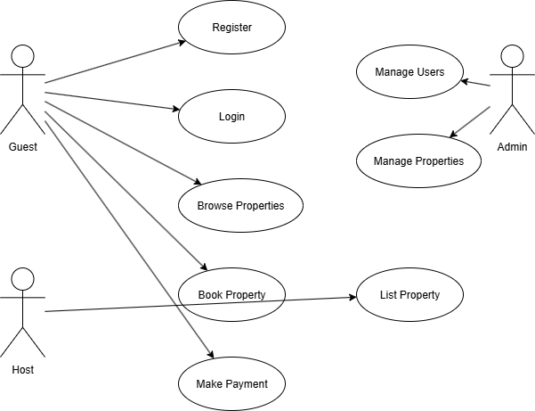

# Airbnb System Use Case Diagram

This directory contains the **Use Case Diagram** for the Airbnb project.

## 📌 Overview
The diagram captures how different users (guests, hosts) and external services (payment provider) interact with the system.

### **Actors**
- **Guest**: Registers, searches for properties, books stays, makes payments, and leaves reviews.
- **Host**: Registers, manages profile, and lists properties.
- **Payment Service**: Handles secure transactions.

### **Use Cases**
- Register/Login
- Manage Profile
- Search Properties
- Book Property
- Make Payment
- View Booking History
- List Property
- Leave Review

## 📷 Diagram

---
**Location in Repo:**  
`alx-airbnb-project-documentation/use-case-diagram/`
